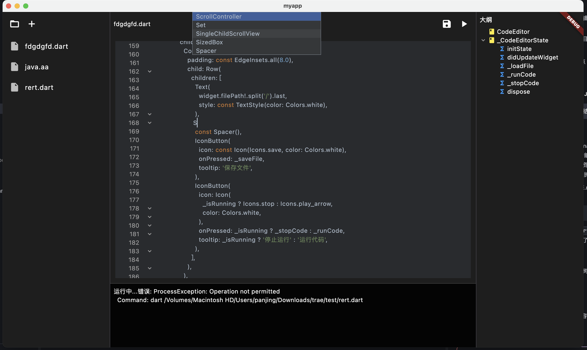

# Flutter代码编辑器

> 这是一个实验性的项目，由AI生成，仅供参考。

## 项目概述

这是一个基于Flutter开发的跨平台应用项目，提供了现代化的开发环境和完整的项目结构。

## 主要功能模块

### 1. 文件浏览器 (File Explorer)
- 位置：`lib/widgets/file_explorer.dart`
- 功能：提供项目文件系统的可视化浏览界面
- 特点：方便用户管理和访问项目文件

### 2. 代码编辑器 (Code Editor)
- 位置：`lib/widgets/code_editor.dart`
- 功能：提供代码编辑和查看功能
- 特点：支持代码高亮和编辑功能

### 3. 语法树组件 (Syntax Tree)
- 位置：`lib/widgets/syntax_tree.dart`
- 功能：展示代码的语法结构
- 特点：帮助开发者理解代码结构

## 技术特点

### 跨平台支持
- 支持多个平台：Android、iOS、Linux、macOS、Windows和Web
- 统一的代码库管理多平台应用

### 开发环境
- 使用Flutter Beta通道
- 完整的项目配置和依赖管理
- 支持热重载等开发特性

### 项目结构
- 清晰的目录组织
- 模块化的代码结构
- 完整的测试支持

## 开发资源
- [Flutter官方文档](https://docs.flutter.dev/)
- [Flutter入门教程](https://docs.flutter.dev/get-started/codelab)
- [Flutter实用示例](https://docs.flutter.dev/cookbook)

## 总结
该项目提供了一个完整的Flutter应用开发框架，包含了现代IDE所需的核心功能组件。通过文件浏览器、代码编辑器和语法树等功能模块的组合，为开发者提供了强大的开发工具支持。项目的跨平台特性和完善的开发环境配置，使其成为一个理想的Flutter应用开发起点。
